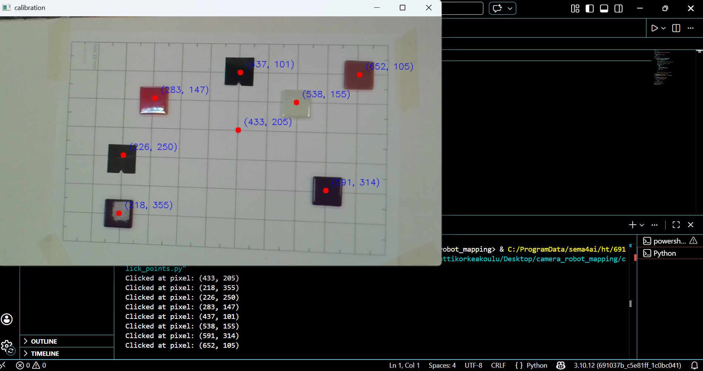

# Camera to Robot Coordinate Mapping using Homography
**Git Hub Link:**
https://github.com/enamulhqdk/Calibration


**Group members:**  
Choton Enamul , Nizam Sabiha , Taqi Muhammad  
**Course:** Machine vision  
**Date:** 13/02/2026  

## Overview

This lab demonstrates how to convert camera image pixel coordinates into robot world coordinates using homography transformation in OpenCV. This allows a robot to detect objects in a camera image and move to their real-world positions in millimeters.

A 25 mm calibration grid was used to establish the relationship between image pixels and robot coordinates.


## Step 1 — Capture Calibration Image

A 25 mm grid was printed and placed on a table. Objects were placed on the grid and a camera image was captured from above.

Calibration image saved as:

```
images/calib_image.jpg
```

---

## Step 2 — Collect Pixel Coordinates

Using `click_points.py`, pixel coordinates were collected by clicking on:

- Robot reference point
- Object positions

Collected pixel coordinates:

| Point | Pixel (u, v) |
|------|--------------|
| P1 | (433, 205) |
| P2 | (218, 355) |
| P3 | (226, 250) |
| P4 | (283, 147) |
| P5 | (437, 101) |
| P6 | (538, 155) |
| P7 | (591, 314) |
| P8 | (652, 105) |
Calibration image with selected points:


---

## Step 3 — Assign Robot Coordinates

Robot reference coordinate:

```
Pixel (433, 205) → Robot (350, 0) mm
```
## Mapping Table (Pixel to Robot Coordinates)

The following table shows the correspondence between image pixel coordinates and robot world coordinates.  
The robot coordinates were determined using the 25 mm calibration grid, with Pixel (433, 205) defined as the robot reference point at (350, 0) mm.

| Point | Pixel (u, v) | Robot (X, Y) mm |
|------|---------------|------------------|
| P1 | (433, 205) | (350.0, 0.0) |
| P2 | (218, 355) | (225.9, 103.9) |
| P3 | (226, 250) | (228.0, 32.1) |
| P4 | (283, 147) | (258.0, -43.1) |
| P5 | (437, 101) | (361.9, -89.9) |
| P6 | (538, 155) | (448.1, -47.8) |
| P7 | (591, 314) | (497.2, 104.5) |
| P8 | (652, 105) | (571.8, -109.3) |

These point correspondences were used to compute the homography matrix using OpenCV.


---

## Step 4 — Compute Homography Matrix

Using OpenCV:

```python
H, mask = cv2.findHomography(img_pts, robot_pts)
```
Computed Homography Matrix:
```python

[[ 0.31390604   0.04592145  117.664009 ]
 [-0.00260329   0.61778711 -125.708906 ]
 [-0.00067575   0.00012159   1.00000000]]
 ```
 This matrix transforms image pixel coordinates into robot world coordinates.


### Step 5 — Pixel to Robot Coordinate Mapping

A function was implemented to convert pixel coordinates into robot coordinates using the homography matrix.
```python
def pixel_to_robot(u, v, H):
    p = np.array([u, v, 1])
    pr = H @ p
    pr = pr / pr[2]
    return pr[0], pr[1]
    
```
### Step 6 — Validation Results
Results:
```python
Pixel (433, 205) → Robot (359.1, -0.3)
Pixel (218, 355) → Robot (225.9, 103.9)
Pixel (226, 250) → Robot (228.0, 32.1)
Pixel (283, 147) → Robot (258.0, -43.1)
Pixel (437, 101) → Robot (361.9, -89.9)
Pixel (538, 155) → Robot (448.1, -47.8)
Pixel (591, 314) → Robot (497.2, 104.5)
Pixel (652, 105) → Robot (571.8, -109.3)
```
### Step 7 — Result

## Step 8— Discussion and Findings

This lab demonstrated how camera pixel coordinates can be accurately transformed into robot world coordinates using homography transformation. The overall process was systematic and practical.

###  Implementation

The process was moderately easy to implement once the steps were understood. The most important parts were:

- Capturing a clear calibration image
- Accurately clicking corresponding points
- Assigning correct robot coordinates using the 25 mm grid
- Computing the homography matrix using OpenCV

.

Initially, understanding the relationship between pixel coordinates and real-world robot coordinates required careful observation of the grid and reference point.

---

### Time required

The complete process took approximately 3–4 hours, including:

- Environment setup and OpenCV installation
- Capturing calibration image
- Collecting pixel coordinates
- Estimating robot coordinates from grid
- Computing and validating homography matrix
- Testing and verifying mapping accuracy

Most of the time was spent ensuring correct point selection and coordinate assignment.

---

### Mapping speed and performance

The mapping process is extremely fast. Once the homography matrix is computed, converting pixel coordinates to robot coordinates takes only a few milliseconds.

This makes the method suitable for real-time applications such as:

- Object detection and picking
